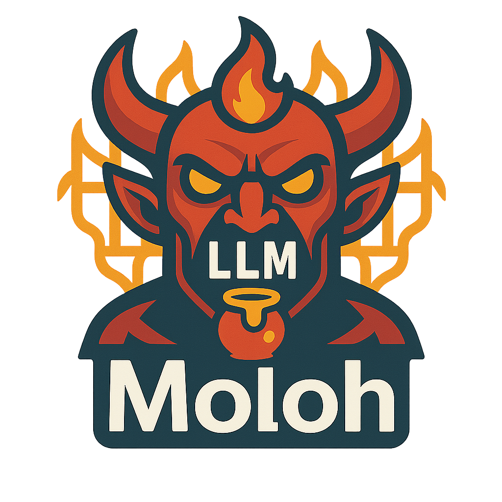

# Moloh

## 🚀 Overview

**Moloh** is an HTTP-only LLM honeypot designed to simulate a
convincing, AI‑driven environment for attackers.\
It uses a Large Language Model to generate dynamic responses and
behavior, while capturing all attacker interactions for later analysis.

Moloh focuses exclusively on **HTTP honeypot interaction**, without
support for other protocols.

Deployment is fully containerized through **Docker Compose** --- no
manual Python installation or pip setup required.

------------------------------------------------------------------------

## 📋 Table of Contents

-   [Features](#features)
-   [Environment Variables](#environment-variables)
-   [Model Downloading](#model-downloading)
-   [Templates Used by the LLM](#templates-used-by-the-llm)
-   [Deployment](#deployment)
-   [Contributing](#contributing)
-   [License](#license)

------------------------------------------------------------------------

## Features

-   🔥 **LLM-powered HTTP honeypot** (no SSH, no Telnet, no mixed
    protocols)
-   🧠 Realistic, model-generated responses to attacker HTTP traffic
-   🐳 Simple and reproducible **Docker Compose** deployment
-   📜 Full logging of interactions
-   🔧 Configurable through environment variables
-   🔄 Automatic model downloading via **Ollama**

------------------------------------------------------------------------

## Environment Variables

You can configure Moloh via `.env`:

### **Model used by the honeypot**

    MODEL="qwen2.5-coder:3b"

### **Optional OpenAI-compatible API**

    OPEN_API_KEY=""

### **Automatic model download via Ollama**

If set, Ollama will fetch the model automatically at container startup:

    DOWNLOAD_MODEL="llama3.1:8b"

------------------------------------------------------------------------

## Model Downloading

Moloh supports two model sources:

### ✔ **Ollama local models**

Ollama will automatically pull the model if:

    DOWNLOAD_MODEL="model_name"

### ✔ **OpenAI-compatible APIs**

If you set:

    OPEN_API_KEY="your-key"

Moloh can route LLM requests through an external API provider.

------------------------------------------------------------------------

## Templates Used by the LLM

Moloh uses predefined system and user prompt templates located here:

    backend/templates/
        mega_prompt_template.txt
        mega_system_prompt_template.txt
        small_prompt_template.txt
        small_system_prompt_template.txt

These define how the model behaves and responds during honeypot
interaction.

------------------------------------------------------------------------

## Deployment

### **Start with Docker Compose**
#### edit .env with your model settings
    cp .env_template .env
    docker-compose up --build

The honeypot will start automatically and download the required model
(if configured).

------------------------------------------------------------------------

## Contributing

Contributions, ideas, and bug reports are welcome!\
Feel free to open an issue or submit a pull request.

Possible areas to improve: - More supported protocols (SMTP,
Telnet, etc.) - Enhanced sandboxing for the LLM backend - Alerting or
monitoring integrations - Better data analysis pipelines

## License

This project is licensed under the **MIT License**

## Contact
For questions or suggestions, feel free to reach out through GitHub
issues.
